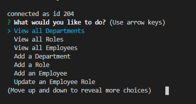
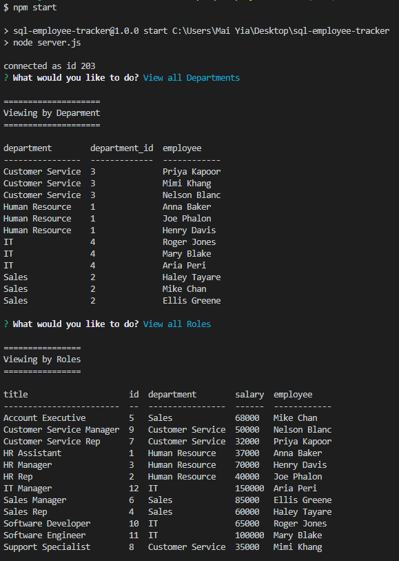

# SQL-employee-tracker

## Purpose

Build a command-line application to manage a company's employee database, using Node.js, Inquirer, and MySQL.

## User Story

AS A business owner  
I WANT to be able to view and manage the departments, roles, and employees in my company  
SO THAT I can organize and plan my business  

## Technology

- Node.js
- MySQL

## Installation & USage

Video tuturial for usage: [Video Link](https://drive.google.com/file/d/15rxbR17H4K9eOPIMGhdJiCVVTh5fyKz2/view)

To use this application, clone this repository and install the following modules.

- install [MySQL2 package](https://www.npmjs.com/package/mysql2) 
  -`npm install --save mysql2`
- install [inquirer package](https://www.npmjs.com/package/inquirer) 
  -`npm install inquirer`
- install [console.table package](https://www.npmjs.com/package/console.table) 
  -`npm install console.table --save`
  
Once all modules are installed, create the datebase using the command line
- Start by logging into mysql: `mysql -u root -p` 
- Create the database: `source db/schema.sql`
- Run the seeds file: `source db/seeds.sql`
- Exit the mysql command line: `quit`
 

Start the application by entering `npm start`.
